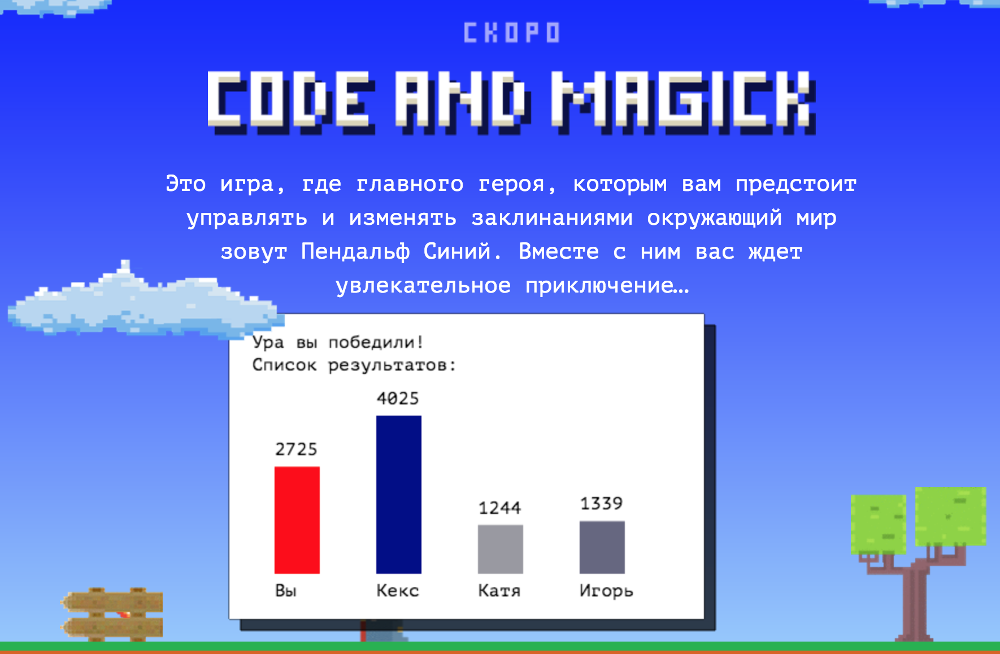

Создайте файл ```js/stat.js``` в проекте. Это файл в котором вы будете реализовывать улучшение игры.

В файле ```index.html``` подключите ваш файл к коду страницы при помощи тега ```script``` непосредственно перед скриптом игры ```game.js```.


В новом файле ```js/stat.js``` определите функцию ```renderStatistics```, которая будет являться методом объекта window, со следующими аргументами:

1. ```ctx``` — [канвас](https://developer.mozilla.org/en-US/docs/Web/API/CanvasRenderingContext2D) на котором рисуется игра.
2. ```names``` — массив, с именами игроков прошедших уровень. Имя самого игрока — Вы. Массив имён формируется случайным образом.
3. ```times``` — массив, по длине совпадающий с массивом names. Массив содержит время прохождения уровня соответствующего игрока из массива names. Время прохождения уровня задано в миллисекундах.

Эта функция будет вызываться каждый раз когда игрок проходит уровень. Чтобы успешно пройти уровень, надо выстрелить фаерболом (клавиша **Shift**) в забор.

При вызове этой функции на канвас ```ctx``` должны быть выведены следующие элементы:

1. Белое облако с координатами ```[100, 10]``` высотой ```270px``` и шириной ```420px```. Облако может быть как правильным многоугольником, нарисованным методом ```fillRect```, так и неправильным нарисованным с помощью методов ```beginPath```, ```moveTo```, ```closePath```, ```fill``` и других.
2. Под облаком должна располагаться тень: многоугольник такой же формы, залитый цветом ```rgba(0, 0, 0, 0.7)``` (полупрозрачный чёрный), смещённый относительно белого на ```10px``` вниз и вправо.
3. На облаке должен быть отрисован текст сообщения **Ура вы победили! \nСписок результатов:** с помощью метода ```fillText```. Текст должен быть набран шрифтом ```PT Mono``` размером ```16px```.
    >>>**Обратите внимание.** Особенностью отрисовки текста на канвасе является то, что он не поддерживает перенос, поэтому каждая новая строчка должна быть отрисована новым вызовом метода ```fillText``` или ```strokeText```.

4. После сообщения о победе должна располагаться гистограмма времён участников. Параметры гистограммы следующие:
    - Высота гистограммы ```150px```.
    - Ширина колонки ```40px```.
    - Расстояние между колонками ```50px```.
    - Цвет колонки игрока **Вы** ```rgba(255, 0, 0, 1)```.
    - Цвет колонок других игроков — синий, а насыщенность задаётся случайным образом.
    >>>**Обратите внимание.** В ```rgba``` последний параметр — это прозрачность, а не насыщенность. Поэтому для задания цвета колонок других игроков нужно использовать ```hsl```. Для перевода цветов из ```rgba``` в ```hsl``` вы можете использовать, например, вот [этот конвертер](https://colorscheme.ru/color-converter.html), там же можно вспомнить особенности разных цветовых форматов.
    - Времена игроков располагаются над колонками.
    - Имена игроков — под колонками гистограммы.
    


>>>**Обратите внимание.** Функцию отрисовки статистики вызывать не надо. Её будет вызывать непосредственно сама игра из файла ```js/game.js```.

>>>**Обратите внимание.** Время прохождения игры должно быть округлено к целому числу.

Ниже показан пример, как может выглядеть экран успешного прохождения уровня.


