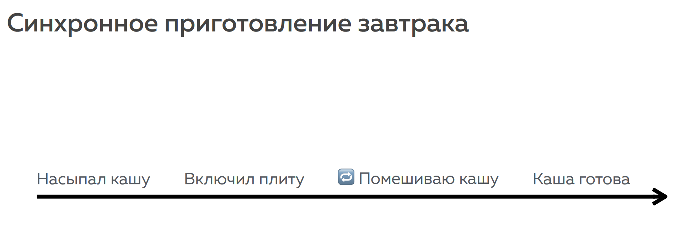
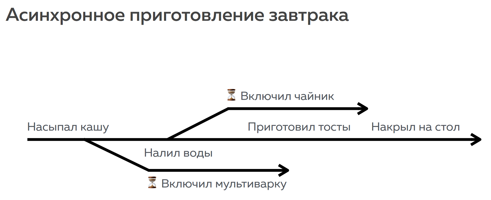
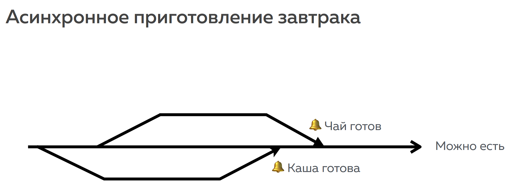

Когда рассказывают про программы и алгоритмы, их часто сравнивают с инструкциями, написанными для человека. Например, вот так выглядит инструкция по приготовлению каши:

1. Насыпал кашу
2. Включил плиту
3. Помешиваю, помешиваю, помешиваю кашу
4. Каша готова

Или схематично:

Человек, следующий этой инструкции, будет выполнять её пункты по очереди. Начнёт с первого пункта, завершив его, перейдёт ко второму, и так далее. Однако, есть кашу всухомятку довольно грустно, поэтому добавим к ней чай. В синхронной схеме чай мы приготовим после того, как каша будет готова:

3. …
4. Каша готова
5. Налил воду в чайник
6. Поставил чайник на плиту
7. Дождался, пока вода закипит
8. Залил чай кипятком
9. Подождал, пока чай заварится
10. Чай готов

Что можно сказать про эту инструкцию? Ну, во-первых, она действительно позволяет приготовить завтрак. Во-вторых, человеку, который решит ей воспользоваться, придётся встать пораньше, если он рассчитывает успеть на работу. Инструкция довольно долгая. Сначала нужно дождаться, пока приготовиться каша, потом — пока вскипит чайник. Да и к моменту, когда чай будет готов, каша наверняка уже остынет. Разумно ли это? Конечно же, нет! Заменим кастрюлю на мультиварку, и чайник на электрический, тогда ждать понадобится намного меньше, потому что готовить можно одновременно.

Перепишем инструкцию с учётом новой техники:

1. Насыпал кашу
2. Включил мультиварку
3. Налил воды в чайник
4. Включил чайник
5. Приготовил тосты
7. Накрыл на стол
8. …
Или схематично:

В этом случае пока каша готовится, мы успеем накрыть на стол. Пока мы накрываем на стол, вероятно, закипит чайник — мы сможем заварить чай, а тут и каша готова. Приятного аппетита.

Схематично:

Согласитесь, оптимальная схема, и поспать с утра можно подольше. Однако мы незаметно отказались от одного свойства, которым обладала предыдущая инструкция — от последовательности.

Мы не можем знать наверняка, что мультиварка подаст сигнал раньше, чем чайник вскипит. Обратное тоже с уверенностью утверждать нельзя. Скорее всего, каша будет готовиться дольше, но может случиться по-всякому. Вдруг у исполнителя очень мощная мультиварка и очень старый чайник. А значит — мы не знаем, в каком порядке и когда завершится то или иное действие.

Второе важное различие: за приготовлением каши в кастрюле целиком и полностью следим мы, и только мы решаем, когда каша будет готова. В случае с мультиваркой, готовность каши зависит от некоего внешнего фактора (мультиварки).

Если говорить на программистском языке, приготовление каши в кастрюле — череда синхронных операций. Синхронные операции производятся одна за другой в предсказуемом порядке. А приготовление каши в мультиварке включает в себя асинхронную операцию. Особенность асинхронных операций, что мы не можем предугадать, в каком порядке они завершатся, и сколько времени займёт каждая.

«Но какое это имеет отношение к веб-программированию?» — спросит нетерпеливый читатель. Самое прямое: браузер — это тоже мультиварка. Разумеется, в переносном смысле. Браузер не умеет варить овсяную кашу (по крайней мере, текущие веб-стандарты этого не предусматривают), зато он умеет выполнять асинхронные операции.

Мы даём ему команду загрузить файл, но не знаем, в какой момент произойдёт загрузка. Мы создаём на странице кнопку, но неизвестно, когда пользователь на неё нажмёт. Точно так же, как и при варке каши, мы можем отдать команду и заниматься своими делами. И когда всё будет готово, браузер подаст сигнал — опять же, совсем как мультиварка.
