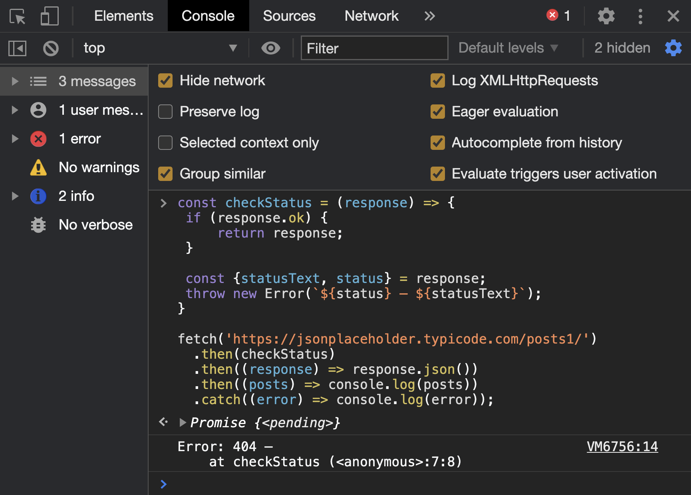

Для отправки запросов к серверу браузеры долгое время предоставляли лишь один способ — объект [```XMLHttpRequest```](https://developer.mozilla.org/ru/docs/Web/API/XMLHttpRequest). В своё время Microsoft сделала прорыв с этой технологией и позже ```XMLHttpRequest``` был стандартизирован WHATWG.

С тех пор прошло много времени и требования к этой, на первый взгляд, несложной задаче изменились. Объектом ```XMLHttpRequest``` пользоваться стало неудобно. Отсутствие поддержки промисов, не совсем очевидный интерфейс и так далее. Это не говорит, что ```XMLHttpRequest``` работает плохо и не годится для взаимодействия с сервером. Вовсе нет. Это по-прежнему рабочий инструмент, но сегодня браузеры предлагают новое, улучшенное API для выполнения запросов — [Fetch API](https://developer.mozilla.org/ru/docs/Web/API/Fetch_API).

## Fetch API
Начнём с преимуществ. Главное преимущество заключается в гибкости и универсальности. Мы говорим Fetch API, но по факту подразумеваем метод ```fetch```. Метод, с помощью которого можно по-разному взаимодействовать с сервером: получать и отправлять произвольные данные с клиента. И для этих задач требуется всего лишь один метод. Это уже проще, чем настраивать ```XMLHttpRequest```.

Помимо этого Fetch API хорошо интегрировано с другими смежными технологиями. Например, с сервис-воркерами (service worker), технологией позволяющий добавить поддержку оффлайн-режима для веб-приложений.

## Поддержка браузерами
Все [современные браузеры](https://caniuse.com/?search=fetch) давно поддерживают ```fetch```. Для более старых доступны полифилы. Выходит, сегодня нет никаких препятствий для использования ```fetch```.

## Метод fetch
Начнём знакомство с методом ```fetch``` с рассмотрения интерфейса. Метод принимает два параметра: адрес ресурса, на который требуется отправить запрос и объект с настройками. Второй параметр опционален и может не использоваться:

```javascript
const promise = fetch(url, [options]);
```

Результатом выполнения метода ```fetch``` станет промис (promise). За счёт поддержки промисов, обрабатывать результат метода ```fetch``` становится гораздо удобней. Попробуем проверить на реальном примере. Запросим информацию о публикациях с песочницы [JSONPlaceholder](https://jsonplaceholder.typicode.com/posts/) с помощью fetch:

```javascript
fetch('https://jsonplaceholder.typicode.com/posts/')
  .then((response) => response.json())
  .then((posts) => console.log(posts))
```

Этот простой пример демонстрирует выполнение ```GET```-запроса для получения данных (список публикаций) в JSON. В первый параметр методу ```fetch``` мы передали адрес ресурса. Второй параметр не задали, так как для выполнения этого запроса дополнительное конфигурирование не требуется. По умолчанию ```fetch``` выполнит именно ```GET``` запрос.

Остановитесь на этом месте и внимательно посмотрите на первую строку. Чтобы выполнить ```GET``` запрос нужна одна строка кода. Это уже маленькая победа.

Метод ```fetch``` не приносит магии — взаимодействие с сервером по-прежнему происходит в асинхронном режиме. Это означает, что запрос не выполнится мгновенно — данные получим не сразу. Результатом выполнения метода станет новый промис в состоянии ожидания.

Раз метод возвращает промис, мы получаем возможность использовать знакомые методы ```then```, ```catch``` и ```finally```. В случае успешного разрешения промиса мы получим экземпляр объекта ```Response```. В нём хранится ответ от сервера. Само собой не в текстом виде, а в структурированном. Объект позволит понять состояние ответа и получить не только данные из тела ответа, но и при необходимости служебную информацию. Например, заголовки, установленные сервером.

В представленном примере нас интересуют только данные. Нам заранее известно, что сервер вернёт информацию о публикациях в JSON. Мы не делаем дополнительных проверок, а сразу пытаемся получить объект из JSON. Для этого мы используем метод ```json()``` у экземпляра объекта ```Response```.

Встроенный метод автоматически извлечёт данные из потока ответа, разберёт их (преобразует в объект) и вернёт новый промис. А раз результатом станет промис, то можно продолжать цепочку ```then``` и обработать результат — получить данные.

Попробуйте скопировать представленный фрагмент кода и выполнить в консоли браузера на любой странице. Спустя мгновение в консоли появится список публикаций.


## Объект Response
Как видите, выполнить ```GET``` запрос при помощи метода ```fetch``` оказалось совсем несложно. Чуть позже мы рассмотрим примеры других запросов, а пока давайте сфокусируем внимание на объекте ответа (```Response```). Его мы получаем при разрешении промиса.

В нём хранится вся информация об ответе сервера. Заголовки, результат выполнения запроса, и другая служебная информация. Всё это доступно в ```Response```. Рассмотрим наиболее полезные свойства этого объекта.

### Результат выполнения запроса
Сервер может исполнить не все запросы. Самая банальная ситуация: запрашиваемый ресурс не найден. Это может случиться по разным причинам: ресурс был, но потом его перенесли в другое место или в адресе была допущена ошибка. На такой запрос сервер ответит кодом ```404```.

Возникает вопрос, а как понять статус выполнения запроса? Ведь если сервер вернул ```404```, то нет никого смысла пытаться извлечь JSON. Данных ведь нет. При этом промис не будет отклонён. Идея перехватить такую ситуацию с помощью ```catch``` не увенчается успехом.

Определить успешность выполнения запроса поможет свойство ```ok```. Оно содержит булево значение. Если запрос выполнен успешно, ```ok``` будет ```true```. В противном случае ```false```.

Звучит не сложно, но возникает вопрос: «А что подразумевается под успехом выполнения»? Успех определяется на основании кода ответа сервера на запрос. Если код ответа в диапазоне чисел ```200-299```, значит он выполнился успешно. Всё что не попадает в диапазон означает ошибку.

Немного доработаем пример получения списка публикаций. Добавим в него проверку успешности выполнения запроса:

```javascript
// Объявим отдельную функцию для проверки
// статус выполнения запроса. Её можно
// описать прямо в `then`, но это ухудшит
// читабельность кода
const checkStatus = (response) => {
  if (response.ok) {
    return response;
  }

  const {statusText, status} = response;
  throw new Error(`${status} — ${statusText}`);
}

// Для проверки обработки ошибки изменить часть адреса
// c `posts` на `post2424`. Заведомо укажите
// несуществующий адрес
fetch('https://jsonplaceholder.typicode.com/posts/')
  .then(checkStatus)
  .then((response) => response.json())
  .then((posts) => console.log(posts))
  .catch((error) => console.log(error));
```

Код примера немного подрос, но мы не потеряли в читабельности. Проверку успешности выполнения запроса вынесли в отдельную функцию ```checkStatus```. Это делать необязательно. Проверку можно описать на месте — в анонимной функции, которую передаём в ```then```.

Однако это скажется на читабельности кода. Кроме того, функция ```checkStatus``` универсальна и пригодится для выполнения схожих операций.

В теле функции ```checkStatus``` выполняется проверка свойства ```ok```. Если оно равно ```true```, значит запрос выполнился успешно. Можно возвращать объект запроса и продолжать конвейер обработки (обработать JSON и так далее).

В случае отрицательного значения ```ok``` нужно что-то сделать. Разумным решением в такой ситуации станет формирование объекта с ошибкой. Для этого создаём экземпляр объекта ```Error```. Параметром в конструктор передадим значение свойств ```status``` и ```statusText```.

В первом свойстве (```status```) доступен код ответа сервера — трёхзначное число. Например, ```404``` (ресурс не найден). А в свойстве ```statusText``` пояснительная строка. Например, ```Not found```. Стоит отметить, что пояснительная строка может отсутствовать.

Подготовив описание ошибки, бросаем исключение при помощи оператора ```throw```. Вернёмся к основному коду. В первый ```then``` передаём ссылку на функцию ```checkStatus```. Если она вернёт промис (запрос выполнен успешно), значит всё хорошо и можно продолжать обработку запроса.

Другой вариант развития событий — исключительная ситуация. Та самая ошибка, которую мы подготовили в функции ```checkStatus```. Её нужно перехватить. Для этого применяем метод ```catch``` и выводим содержимое ошибки в консоль.

Скопируйте приведённый фрагмент кода и выполните в консоли браузера. Код выполнится без ошибки. В консоли отобразятся публикации. Чтобы протестировать второй сценарий (возникновение ошибки), исправьте адрес (пример в комментарии). Затем вновь выполните код. В этот раз произойдёт ошибка, которую перехватит ```catch```.



### Обработка ошибок
Для обработки успешности выполнения запроса применяется свойство ```ok``` или ```status```. Последнее может быть полезным, если требуется более тонкая проверка и разные реакции на различные коды ответов.

Хорошо, а как быть с другими ошибками? Рассмотренный пример хорошо подходит для обработки выполнения запросов, но могут возникнуть ситуации, когда запрос вовсе не получилось отправить. Типичный пример — ошибка сети.

В такой ситуации промис, возвращаемый методом ```fetch```, будет отклонён (```rejected```). Следовательно, обработать такую ошибку поможет метод ```catch```. Поэтому не забывайте добавлять его в конце цепочки ```then```.

Для проверки этого сценария на практике скопируйте предыдущий фрагмент кода в консоль, но не выполняйте. Сначала перейдите на вкладку «Network» и включите режим «Offline». После этого вернитесь в консоль и выполните код примера.


Как видите, произошла ошибка «Failed to fetch» и она была успешно обработана с помощью ```catch```.

### Заголовки
Любой ответ содержит заголовки. На клиенте с ними работать приходится реже (по сравнению с сервером). Установленные заголовки доступны через свойство ```headers```. Это обычный объект, поэтому используются стандартные приёмы работы c объектами.

## Не только JSON
После прочтения всего перечисленного может сложиться впечатление, что ```fetch``` предназначен лишь для работы с данными в формате JSON. Это не так. Объект ```Response``` предоставляет несколько готовых методов для получения тела ответа в другом формате. Некоторые из них:

* ```blob()``` — возвращает тело ответа в виде бинарных данных с установленным типом. Пригодится для получения файлов, изображений и так далее.
* ```formData()``` — возвращает тело ответа в виде объекта ```FormData``` — пары/ключ значения, представляющие поля формы.
* ```text()``` — возвращает тело ответа в виде текста в кодировке ```UTF-8```.

Перечисленные методы применяются реже, чем ранее рассмотренный ```json()```, но всё же могут встретиться. Рассмотрим несколько примеров. Обработку ошибок делать не станем для краткости:

```javascript
// Загрузим произвольное изображение.
fetch('https://www.fillmurray.com/200/300')
    .then((response) => response.blob())
    .then((imageBlob) => {
        const newImage = document.createElement('img');
        newImage.src = URL.createObjectURL(imageBlob);
        document.body.appendChild(newImage)
    });   
```

В этом примере кода происходит загрузка изображения с сервиса «FillMurray». Пусть ссылка не содержит расширение, но при обращении к ней мы получим ссылку на изображение. Дальше применяем метод ```blob()``` у объекта с ответом. Он вернёт тело ответа в виде бинарных данных.

Последний шаг — обработка результата. Создаём новой элемент ```img``` и добавляем загруженное изображение. Применение других методов выполняется аналогичным образом.

## Повторный вызов методов
При использовании методов чтения контента ответа, следует помнить: можно воспользоваться только одним. Если выполнить чтение ответа с помощью ```json()```, то ниже применить ```text()``` (или другой) уже не получится. Произойдёт ошибка.

Необходимость применять разные методы для одного ответа крайне мала, поэтому с такой ситуацией вы вряд ли столкнётесь на практике. Однако, если такая задача возникнет, то её можно решить предварительным клонированием объекта c ответом. Для этого у него есть метод [```clone```](https://developer.mozilla.org/en-US/docs/Web/API/Response/clone).

## Отправка информации на сервер
Как мы отметили выше, работа с ```fetch``` не ограничивается лишь получением данных от сервера. Ничего не мешает их передавать различными методами. Эта задача не сильно сложней, но придётся задействовать второй параметр метода ```fetch``` — объект с настройками.

Попробуем подготовить и отправить запрос методом ```POST``` (речь о методе в контексте протокола HTTP). Экспериментировать будем на песочнице «JSONPlaceholder», поэтому все примеры сможете повторить в своём браузере, просто копируя код и выполняя его в консоли.

```javascript
// Отправим информацию о новой публикации
// на сервер HTTP-методом POST.

// Данные для отправки
const post = {
  id: 1,
  userId: 31337,
  title: 'Обзор метода fetch',
  body: 'Содержимое обзора',
}

// Вторым параметром передадим объект с конфигурацией.
// Определим в нём метод, заголовки и тело запроса.
fetch('https://jsonplaceholder.typicode.com/posts', {
    // Вместо 'POST' здесь может быть
    // любой другой  HTTP-метод.
    method: 'POST',
    headers: {
        'Content-Type': 'application/json'
    },
    body: JSON.stringify(post)
})
    .then((response) => response.json())
    .then((json) => console.log(json));
```


В этом примере кода задействован второй параметр метода ```fetch```. В него мы передаём объект с настройками. По умолчанию метод ```fetch``` выполняет HTTP-запрос методом ```GET```. Метод переопределяется в объекте с конфигурацией, в одноимённом свойстве ```method```. На месте ```POST``` может быть любой другой HTTP-метод. Например: ```PUT```, ```PATCH```, ```DELETE``` и так далее.

При подготовке запроса нам доступна возможность установить произвольные заголовки. Для этого в конфигурационном объекте предусмотрено свойство ```headers```. Это обычный объект, где каждая пара ключ/значение описывает заголовок.

В приведённом примере определяем один заголовок — ```Content-Type``` (тип содержимого). Данные передаются в формате JSON, ему соответствует тип ```application/json```. Другие заголовки добавляются аналогичным образом. Например, если потребуется добавить заголовок ```User-Agent```, то достаточно описать ещё одну пару ключ/значение:

```javascript
// …
headers: {
  'Content-Type': 'application/json',
  'User-Agent': 'Google Chrome'
},
```
Тело запроса фиксируется в свойстве ```body```. Мы планируем отправить данные в JSON, поэтому сразу сериализуем подготовленный объект с данными.

Дальше всё повторяется — пишем код для обработки ответа. Ответом на такой ```POST``` запрос станет JSON, содержащий созданную сущность.

## Отправка формы
При помощи метода ```fetch``` можно отправить и форму. Он поддерживает интерфейс FormData, следовательно дополнительных преобразований делать не нужно. Рассмотрим пример: попробуем отправить форму ```.user-form``` с помощью метода ```fetch```:

```javascript
const userForm = document.querySelector('.user-form');
userForm.addEventListener('submit', (evt) => {
    evt.preventDefault();
    
    // Отправка формы
    fetch('/form', {
        method: 'POST',

        // Содержимое формы помещаем в тело
        // запроса.
        body: new FormData(userForm),
    })
        // Дальше может быть обработка результатов…    
        .then((response) => console.log(response));    
});
```

Пример не содержит описание формы. В данном контексте это не сильно важно. Мы находим форму ```.user-form```, подписываемся на событие ```submit``` и при его наступлении выполняем отправку. Поскольку форма отправляется методом ```POST```, приходится задействовать второй параметр и подготовить объект с настройками. Содержимое формы получаем при помощи объекта ```FormData``` и устанавливаем в тело запроса (```body```). Если форма содержит поле ```<input type="file">```, то дополнительных действий делать не требуется. Файл будет отправлен.

Дальше сценарий ничем не отличается от рассмотренных ранее — выполняем ```then``` и можем приступать к обработке результатов отправки формы.

## Ещё более короткий синтаксис
Пользоваться методом ```fetch``` несложно. API лаконичен, а результат в виде объекта-промис упрощает обработку. Мы можем легко группировать операции обработки результаты в цепочки, тем самым упрощая код.

Поскольку применяются промисы, то ничего не мешает воспользоваться операторами ```async/await```. Они позволяют сделать код ещё более похожим на синхронный. Стоит ли использовать их повсеместно? Зависит от ситуации и предпочтений.

```javascript
(async () => {
    const response = await fetch('https://jsonplaceholder.typicode.com/posts');
    const posts = await response.json();
    console.log(posts);
})();
```
