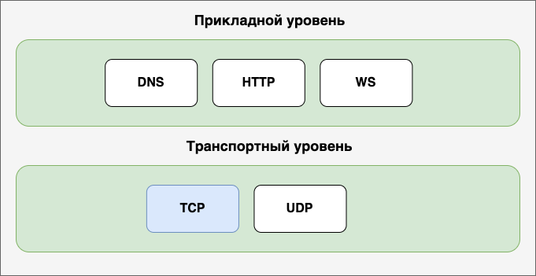
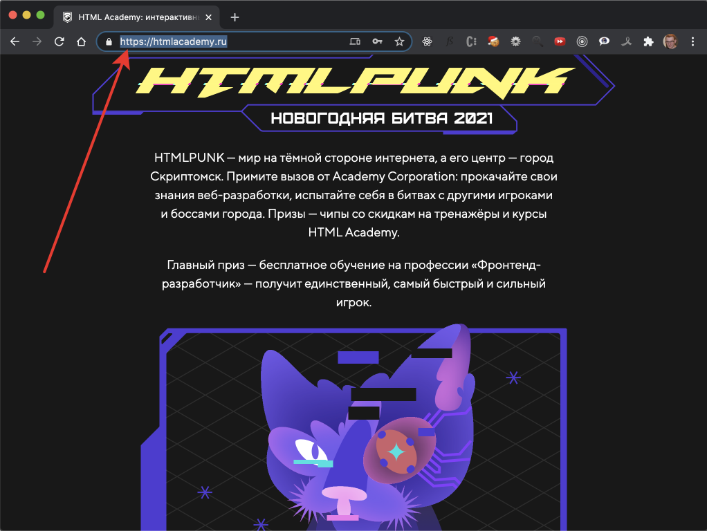
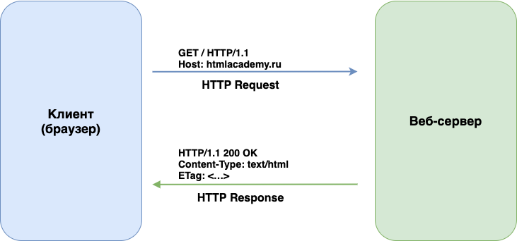
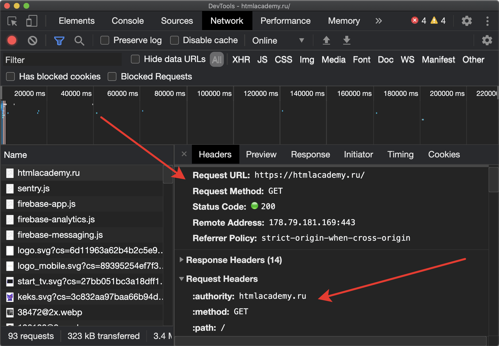
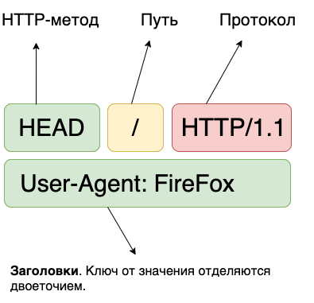
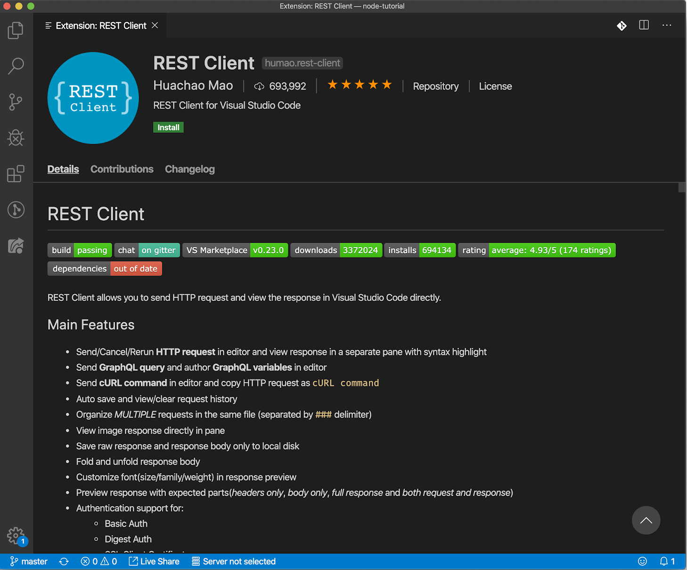
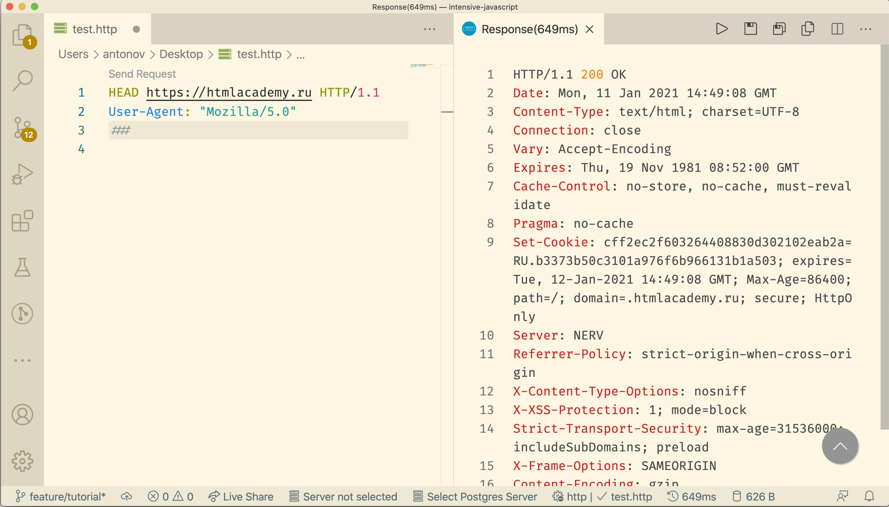

HTTP — это сетевой протокол прикладного уровня, то есть для «общения» между программами. Протокол появился в начале 90-х и применяется до сих пор. Аббревиатура HTTP расшифровывается как «HyperText Transfer Protocol» (протокол передачи гипертекста).

У этого протокола есть несколько версий. На сегодняшний день актуальными являются [1.1](https://tools.ietf.org/html/rfc2616) и [2.0](https://tools.ietf.org/html/rfc7540) Окончательная спецификация второй версии появилась лишь в 2015 году и уже идут работы над [третьей версией](https://ru.wikipedia.org/wiki/HTTP/3).

Вся информация о любых протоколах представлена в документах RFC (Request for Comments). Протокол HTTP не является исключением. Полные сведения о первой версии протокола детально описаны в [RFC2616](https://tools.ietf.org/html/rfc2616).

Изначально протокол HTTP проектировался для передачи гипертекста (вспомните расшифровку аббревиатуры). Однако сегодня он используется и в качестве транспорта для передачи информации другими протоколами прикладного уровня. Такие протоколы как XML-RPC, WebDav, WS могут использовать HTTP в качестве транспорта.



## Принцип работы
С HTTP-протоколом мы сталкиваемся постоянно — на нём держится всемирная паутина. Всякий раз при переходе на любой веб-сайт, применяется именно HTTP-протокол. Браузер использует его для взаимодействия с сервером.

Возможно вы этого не замечали: название протокола вводится вместе с адресом сайта. Современные браузеры не требуют исполнения этого правила. Более того, по умолчанию они скрывают применяемый протокол. Обратите внимание на адресную строку. В ней отображается адрес ресурса без указания протокола. Однако, если кликнуть в адресную строку, то адрес отобразится полностью, включая протокол.



Напомним: HTTP-протокол решает задачу обмена данными. Участники обмена: сервер и клиент. Клиент (например, браузер) формирует запрос и отправляет его серверу. Сервер (программа веб-сервер) получает запрос, анализирует и возвращает ответ. Клиент, получив ответ, обрабатывает его и выполняет какое-то действие. Например, отрисовывает страницу.



Общий принцип должен быть понятен, но как именно браузер соединяется с сервером? Ведь на сервере могут быть запущены сотни приложений, которые принимают соединения. Как браузер находит именно веб-сервер?

Когда вы вводите адрес сайта в адресной строке и нажимаете ```Enter```, происходит примерно следующее (рассматриваем максимально упрощённый сценарий):

* Чтобы соединиться с сервером, браузеру необходимо получить его IP-адрес. Мы привыкли пользоваться символьными адресами — их проще запомнить, чем сочетание цифр. Программы наоборот, предпочитают числа. После ввода в адресной строке ```htmlacademy.ru```, первой задачей браузера станет получение IP адреса для ```htmlacademy.ru```. Для этого он выполнит запрос к DNS-серверу, который на основании символьного адреса вернёт IP-адрес — ```178.79.181.169```. Получив IP-адрес, браузер попытается установить соединение с сервером. Для этого он воспользуется протоколом транспортного уровня — [TCP](https://ru.wikipedia.org/wiki/Transmission_Control_Protocol). На сервере может быть запущено множество сервисов, но браузер по умолчанию подключится к 80-му порту. Почему именно к нему — расскажем позже.
* Установив соединение, браузер сформирует HTTP-запрос и передаст его серверу. Здесь и вступает в работу протокол HTTP. Две программы, браузер и сервер, начинают «общаться». Браузер направляет запрос, а сервер — ответ. Запрос — это обычный текст, составленный в соответствии с правилами протокола. Запрос включает в себя служебную информацию и, самое главное, адрес ресурса, который требуется получить.

Вернёмся к номеру порта. А почему браузер пытается установить соединение именно на 80-й порт? Как он определяет, что его ждут именно там? По умолчанию веб-серверы ожидают подключений именно на 80-м порту. Это договорённость.

Это, конечно, не означает, что веб-сервер может работать только на 80-м порту. Администратор сервера может изменить правила игры и настроить веб-сервер для приёма соединений от клиентов на другой порт. Например, 3666.

В этом случае порт необходимо указать самостоятельно при вводе адреса. Порт указывается после символа двоеточие (```:```). Например, если сервер ```htmlacademy.ru``` принимает соединения на порт ```3666```, то адрес станет таким: ```https://htmlacademy.ru:3666```.

## Отправка запросов
Самый простой способ познакомиться с нюансами работы протокола HTTP — научиться самостоятельно выполнять запросы. Обычно за вас это делает браузер. Прямо сейчас вашему браузеру пришлось отправить несколько HTTP-запросов, чтобы получить этот раздел.

Само собой, браузер скрывает детали. Для вас всё сводится к вводу адреса и получению результата (готовой страницы). Как выглядит сам HTTP-запрос вы не знаете, но это легко исправить, посмотрев вкладку «Network» (сеть) в инструментах разработчика. На четвёртом рисунке красными стрелками отмечен HTTP-запрос ```https://htmlacademy.ru```. Ниже мы покажем как составить и выполнить такой запрос самостоятельно.



Попробуем немного побыть в роли браузера и самостоятельно отправим HTTP-запрос. Вручную. Для этого потребуется лишь консольная утилита ```telnet```. Она входит в состав всех операционных систем.

Важно! Если вы используете операционную систему от Microsoft, то приложение ```telnet``` может отсутствовать по умолчанию. В этом случае необходимо установить этот компонент в операционной системе. Эта операция выполняется с помощью апплета «Программы и компоненты». Он доступен в «Панели управления». В качестве более продвинутой альтернативы для Windows, можно воспользоваться приложением [PuTTY](https://putty.org.ru/). Оно лишено ограничений устаревшего ```telnet```.

Важно! В последних версиях macOS приложение ```telnet``` также недоступно по умолчанию, но его легко установить с помощью пакетного менеджера ```brew```. Для установки выполните ```brew install telnet```.

Запустите терминал и выполните команду: ```telnet htmlacademy.ru 80```. Обратите внимание, используется символьный адрес ресурса. Следовательно, сначала автоматически выполнится DNS-запрос для получения IP-адреса, а только потом начнётся попытка установки соединения с сервером.

После установки соединения, необходимо отправить HTTP-запрос. Запрос состоит из нескольких частей: строка запроса (request line), заголовки (headers, служебная информация) и тело запроса (body). Тело запроса необходимо не во всех случаях.



В строке запроса указывается HTTP-метод. Протокол HTTP определяет перечень [методов](https://tools.ietf.org/html/rfc7231#section-4). Метод позволяет серверу понять, как следует обрабатывать этот запрос. После метода следует строка запроса (query string), название и версия протокола.

Не будем углубляться в детали, а попробуем составить запрос с применением метода ```HEAD```. Это один из самых простых в понимании методов. Он позволяет запросить у сервера только заголовки — служебную информацию, без контента.

Более распространённым является метод ```GET```. Браузер каждый раз использует его, когда запрашивает страницу с сервера или какие-нибудь ресурсы. Мы воспользуемся методом ```HEAD``` ради упрощения примера. Он вернёт всё ту же служебную информацию, что и ```GET```, только без контента — кода страницы.

А зачем может потребоваться выполнять такой запрос, если сервер не вернёт контент? Метод ```HEAD``` пригодится для предварительной подготовки. Например, узнать размер контента, который придётся загрузить, выполнив метод ```GET```.

Попробуем составить запрос, с применением метода ```HEAD```. Выше мы отметили, http-запрос — это просто текст. Вернитесь в терминал. Если соединение с сервером пропало — не переживайте. Это абсолютно нормальная ситуация. Сервер разрывает соединение, если оно не используется n-секунд. В такой ситуации следует повторно подключиться к серверу. После подключения, опишите запрос, придерживаясь схемы: ```<HTTP-метод> <URI> <Протокол>/<Версия>```:

```txt
HEAD / HTTP/1.1
Host: htmlacademy.ru
```

После ввода текста запроса, дважды нажмите клавишу ```Enter```. Ввод подряд двух символов перевода каретки объяснит серверу, что текст запроса завершён и можно приступать к обработке. Сервер вернёт ответ и разорвёт соединение или наоборот, оставит активным:

```txt
HTTP/1.1 301 Moved Permanently
Server: nginx
Date: Thu, 31 Dec 2019 14:17:13 GMT
Content-Type: text/html
Content-Length: 178
Connection: keep-alive
Location: https://htmlacademy.ru/
```

Поздравляем, вы выполнили первый HTTP-запрос в терминале. Как видите, в этом нет ничего сложного. Обратите внимание, после выполнения запроса сервер самостоятельно разорвал соединение. Если требуется выполнить ещё один запрос, придётся повторить всю процедуру заново.

Разберём ответ сервера. В первой строке определена версия протокола (```HTTP/1.1```), код состояния (```status code```) и поясняющий текст. Эту строку принято называть «строка состояния» (status line).

## Коды состояний
Код состояния состоит из трёх цифр. Первая цифра определяет класс состояния, а две последующие — статус выполнения операции. Спецификация определяет 5 классов состояний:

* 1 — информационные (informational);
* 2 — успешно (success);
* 3 — перенаправление (redirection);
* 4 — ошибка клиента (client error);
* 5 — ошибка сервера (server error).

За кодом состояния следует строка с пояснительным текстом. Он поможет узнать информацию о выполнении операции, не вспоминая, что же означает код состояния. Например:

* ```200 OK``` — запрос выполнен успешно;
* ```404 Not Found``` — страница/ресурс не найден.
В нашем случае сервер вернул код ```301``` (перенаправление), а в строке с пояснением — ```Moved Permanently``` (перемещено навсегда). Это означает, что запрашиваемый ресурс перемещён и доступен по другому адресу. Какому? Ответ содержится в заголовке Location. В нём указан новый адрес ресурса. Обратите внимание, в качестве нового адреса указан ```https://htmlacademy.ru```. Вместо ```http``` применяется ```https``` — безопасная версия протокола.

## HTTP и HTTPS
HTTPS — это расширение протокола HTTP, а не самостоятельный протокол. Оно добавляет поддержку шифрования трафика, то есть повышает безопасность. Аббревиатура расшифровывается так: ```HyperText Transfer Protocol Secure``` — безопасный протокол передачи гипертекста. Соединение, установленное через HTTPS, шифруется. Таким образом, смысл в перехвате трафика теряется.

Детально рассматривать HTTPS не будем. Более подробная информация доступна в этой [статье](https://ru.wikipedia.org/wiki/HTTPS). Акцентируем внимание лишь на порт.

Вы знаете: по умолчанию веб-сервер ожидает подключение на 80-й порт. Эта договорённость справедлива для протокола HTTP. А для HTTPS-соединений действует другое правило: веб-серверы ожидают безопасные подключения по умолчанию на ```443``` порту.

Например, чтобы выполнить ```HEAD /``` метод для ```https://htmlacademy.ru```, нам необходимо установить соединение с ```443``` портом вместо 80-го (в telnet этот пример не воспроизведётся).

## Вернёмся к ответу
Сервер ответил кодом ```301```, сообщив о новом расположении ресурса. Напомним, новое расположение фиксируется в заголовке ```Location```. В ответе заголовков может быть большое количество. Они помогают клиенту правильно обработать ответ. Разберём заголовки из ответа:

* ```Server: nginx```. Содержит информацию о веб-сервере. В данном случае использует веб-сервер nginx — самый популярный веб-сервер;
* ```Date: Thu, 31 Dec 2019 14:17:13 GMT```. Дата ответа;
* ```Content-Type: text/html```. Тип содержимого, которое вернёт сервер для запроса.
* ```Content-Length: 178```. Размер содержимого в байтах.
* ```Connection: keep-alive```. Определяет останется ли соединение открытым после выполнения запроса. Значение ```close``` подразумевает, что соединение будет закрыто, а ```keep-alive``` — наоборот — останется открытым. Зависит от версии протокола.

Для ```GET``` запроса сервер вернёт дополнительно HTML-код страницы (если ресурс существует). Другие виды запросов выполняются аналогичным образом.

## Полезные инструменты
Для выполнения и проверки HTTP-запросов необязательно применять терминал. Мы рассмотрели этот вариант для наглядности. Выполнять запросы по протоколу HTTP (S) удобно при помощи расширения [REST Client](https://marketplace.visualstudio.com/items?itemName=humao.rest-client) для редактора Visual Studio Code.



Расширение позволяет создавать и выполнять запросы прямо в текстовом редакторе. Рассмотрим пример. Установите расширение и создайте новый файл в с расширением ```.http```. После этого можно приступать к написанию запросов. Структура запросов точно такая же:

```text
<HTTP-Метод> <URI> <Протокол>/<Версия>`
<Headers>
```

Попробуем описать ранее рассмотренный ```HEAD```-запрос. После описания запроса появится кнопка «Send request» (отправить запрос). Нажмите её. Результат выполнения запроса откроется в отдельном окне.

```text
HEAD https://htmlacademy.ru HTTP/1.1
User-Agent: "Mozilla/5.0"
```



## Резюме
Спецификация протокола HTTP предусматривает множество заголовков и методов. Их не нужно заучивать прямо сейчас. На данном этапе важно понять общий принцип работы.
