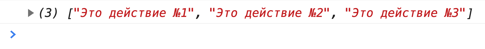
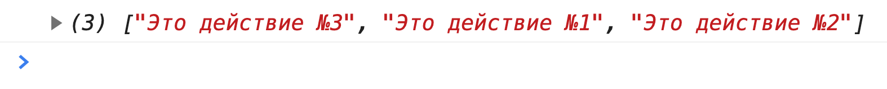
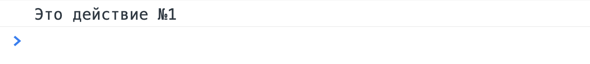

Мы познакомились с методами ```then``` и ```catch```, но у объекта ```Promise``` ещё осталось несколько тузов в рукаве. Рассмотренные ниже методы обязательно пригодятся вам при решении практических задач в программе интенсива. Начнём с методов ```resolve``` и ```reject```.

## resolve() и reject()
В прошлом материале мы пользовались конструктором ```Promise``` для создания новых промисов. Это отличный вариант, но в некоторых ситуациях он многословен. Например, у нас есть функция, которая должна только возвращать промис в состоянии ```fulfilled``` (для построения цепочки). В этом случае создавать объект, описывать функцию-исполнитель немного многословно.

К счастью, у объекта ```Promise``` есть два статических метода: ```resolve``` и ```reject```. Первый, как и следует из названия позволяет сразу выполнить промис, а второй отклонить. Благодаря этим статическим методам, мы можем обойтись без громоздкой записи. Оба этих метода возвращают промис. Рассмотрим простой пример:
```javascript
const getRemoteData = () => Promise.resolve(`Данные загружены!`);
const getBadData = () => Promise.reject(`Произошла ошибка`);

getRemoteData()
  .then((value) => console.log(value))
  .then(getBadData)
  .catch((error) => console.log(error));
```
В этом примере у нас есть две функции ```getRemoteData``` (не будем вдаваться в детали её предназначения) и ```getBadData```. Мы знаем, что первая функция всегда будет выполнять промис, поэтому для сокращения кода можем воспользоваться методом ```resolve```. Это равносильно, если мы написали бы:
```javascript
return new Promise((resolve, reject) => {
  resolve(`Данные загружены!`);
});
```
Далеко не во всех случаях возникает необходимость отклонить промис, а раз так, то мы можем выразить это более лаконично. С отклонением промиса ситуация похожа. Для этого нам доступен статический метод ```reject```. Его применение демонстрирует функция ```getBadData```.

## all()
Другим не менее важным и полезным методом у объекта ```Promise``` является — ```all()```. Метод принимает в качестве единственного параметра массив из промисов и возвращает новый промис, который будет выполнен, после выполнения всех промисов, переданных в метод ```all```, или отклонён в случае отклонения одного из промисов той же коллекции.

Метод ```all``` нам пригодится в ситуациях, когда требуется дождаться выполнения нескольких промисов. Например, нам требуется выполнить несколько асинхронных операций, а только потом начать работать с полученными данными. Чтобы было проще представить, рассмотрим эту задачу сразу на примере:
```javascript
const TIMEOUT = 1000;

const makeThing = (number) => {
  return new Promise((resolve, reject) => {
    setTimeout(() => {
      resolve(`Это действие №${number}`);
    }, TIMEOUT);
  });
};

const firstThing = makeThing(1);
const secondThing = makeThing(2);
const thirdThing = makeThing(3);

Promise
  .all([
    firstThing,
    secondThing,
    thirdThing
  ])
  .then((value) => console.log(value));
```
Функция ```makeThing``` делает бесполезную работу — принимает номер действия и формирует информационную строку, используя этот номер. Дальше мы определяем несколько действий — 1, 2, 3. Наша задача дождаться выполнения всех этих действий, а затем обработать результат.

Метод ```all``` помогает решить эту задачу. В качестве параметра мы передаём массив из подготовленных промисов. Результатом будет новый промис, который в случае успешного выполнения позволит получить результат выполнения всех промисов. Таким образом, ```value``` будет содержать массив со значениями выполненных промисов.



Обратите внимание на порядок значений в результирующем массиве. Он соответствует порядку переданных в метод ```all``` промисов. В качестве эксперимента вы можете изменить порядок промисов, передаваемых в метод ```all```:

```javascript
.all([
    thirdThing,
    firstThing,
    secondThing,
  ])
```

Мы нарочно поставили на первое место третий промис. Результаты выполнения изменятся:



## race ()
У объекта ```Promise``` есть ещё один полезный метод — ```race```. Дословно это слово можно перевести как «гонка». В отличие от метода ```all```, он не будет ждать выполнения всех промисов, а дождётся выполнения первого. Здесь уже порядок промисов, передаваемых в качестве параметра, не имеет значения. Рассмотрим пример синтаксиса:

```javascript
// Предыдущий код идентичен
Promise
  .race([
    thirdThing,
    firstThing,
    secondThing,
  ])
  .then((value) => console.log(value));
```

Результат выполнения вы можете увидеть на рисунке ниже.


