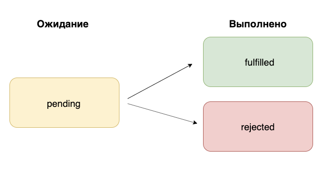

При написании асинхронного кода мы используем функции обратного вызова. Почему? Асинхронные операции выполняются не сразу. Чтобы выполнить какое-то действие после завершения асинхронной операции, в JavaScript применяют функции обратного вызова или, проще говоря, — колбэки. Это утверждение вы неоднократно успели проверить на практике. Идея функций обратного вызова предельно проста, но с ними легко зарулить на шоссе «ад колбэков».

## Ад колбэк-функций (callback hell)
За примером далеко ходить не надо. Простая задача: требуется запросить с сервера несколько наборов данных: получить список пользователей, затем их публикации, и в конце концов комментарии к этим публикациям. Три запроса, каждый из которых должен быть выполнен после предыдущего. Для большей визуализации посмотрим на абстрактный пример кода:
```javascript
getUsers((error, users) => {

  // Обрабатываем список пользователей
  // и запрашиваем их публикации    
  getPosts(users, (error, posts) => {

    // Обрабатываем публикации пользователей
    // и запрашиваем к ним комменты       
    getComments(posts, (error, comments) => {

      // Обрабатываем комментарии
      // Здесь может быть что-то ещё…         
    });    
  });
});
```
В этом примере три асинхронных операции. Каждая из них принимает два параметра: данные (результат работы предыдущей функции) и функцию обратного вызова. Параметр ```error``` хранит информацию об ошибке. Функция будет выполнена после завершения асинхронной операции. Уже сейчас, глядя на этот код, становится немного не по себе: он превращается в лесенку. Обратите внимание, мы только определили цепочку вызовов асинхронных операций. В настоящем приложении между вызовами этих функций может находится дополнительный код, а асинхронных операций быть значительно больше. В этом и заключается ад колбэков: «лестница» продолжит расти при добавлении асинхронных операций. Поддержка кода усложнится или станет вовсе нереальной.

## Promise (промисы)
Бороться с «лестницей в ад» можно несколькими способами. Самый банальный — реструктуризация кода. Ничего не мешает вынести реализацию отдельных операций в именованные функции и таким образом немного разгрузить основной код. Способ рабочий, но не сильно действенный. Провернуть такой трюк получится далеко не всегда.

Более элегантный способ заключается в применении ```Promise``` (обещания, далее «промисы»). Поддержка промисов появилась в ECMAScript 2015. Промисы позволяют организовать асинхронный код по-другому. Сделать его более плоским и последовательным, похожим на синхронный код.

**Промис** — это специальный объект (```Promise```). Он позволяет отследить выполнение асинхронной операции и сохранить её результат. Сами асинхронные операции выполняются как и прежде: не сразу, а когда-нибудь. Поэтому важно запомнить и уяснить, промисы — это не «магическая» замена асинхронных операций и не возможность получить результат такой операции сразу. Это просто объект, позволяющий более эффективно работать с асинхронным кодом.

## Иллюстрация проблемы
Любую тему в программировании лучше разбирать на примерах. Промисы не являются исключением. Давайте возьмём какой-нибудь код с колбэками и попробуем его переписать с использованием промисов. Начнём с абстрактных примеров: напишем простейшую программу для приготовления супа:
```javascript
const TIMEOUT = 1000;

const makeSoup = () => {
  console.log(`> Иду за продуктами`);
  const products = [`Капуста`, `Картофель`, `Мясо`];
  setTimeout(() => {
    console.log(`> Нарезаю продукты: ${products.join(`, `)}`);
    setTimeout(() => {
      console.log(`> Продукты нарезаны!`);
      setTimeout(() => {
        console.log(`> Начинаю варить суп из: ${products.join(`, `)}`);
        setTimeout(() => {
          return Math.random() > 0.5
            ? console.log(`> Суп готов!`)
            : console.log(`> Упс! Сломалась плита.`);
        }, TIMEOUT);
      }, TIMEOUT);
    }, TIMEOUT);
  }, TIMEOUT);
};

makeSoup();
```
В этом коде визуализируется асинхронный процесс приготовления супа. Все асинхронные операции имитируются при помощи ```setTimeout```. Попробуйте скопировать этот код и выполнить его в REPL (например, в консоли браузера) несколько раз. Сообщения в консоли будут появляться с небольшой задержкой. Прекрасная иллюстрация работы асинхронного кода без лишних сложностей.

Наигравшись с кодом, посмотрите на него ещё раз более придирчивым взглядом. Что в нём не нравится? Пожалуй, ответ очевиден: лестница колбэк-функций. Можно попытаться порефакторить этот код и немного «замазать» проблему. Однако, корень зла останется и обязательно проявит себя чуть позже.

## Решение на промисах
Попробуем решить эту же задачу при помощи промисов. Не будем углубляться в теорию, а сразу применим промисы на практике. Детали работы с ними разберём чуть позже. Сейчас важно увидеть их в действии. Попробуйте выполнить ниже приведённый фрагмент кода:
```javascript
const TIMEOUT = 1000;

const buyProducts = () => {
  console.log(`> Иду за продуктами...`);
  return new Promise((resolve) => {
    setTimeout(() => {
      const products = [`Картофель`, `Капуста`, `Мясо`];
      resolve(products);
    }, TIMEOUT);
  });
};

const prepareProducts = (products) => {
  console.log(`> Нарезаю продукты: ${products.join(`, `)}`);
  return new Promise((resolve) => {
    setTimeout(() => {
      console.log(`> Продукты нарезаны!`);
      resolve(products);
    }, TIMEOUT);
  });
};

const makeSoup = (preparedProducts) => {
  console.log(`> Начинаю варить суп из: ${preparedProducts.join(`, `)}`);
  return new Promise((resolve, reject) => {
    setTimeout(() => {
      return Math.random() > 0.5
        ? resolve(`> Суп готов!`)
        : reject(`> Упс! Сломалась плита.`);
    }, TIMEOUT);
  });
};

buyProducts()
  .then(prepareProducts)
  .then(makeSoup)
  .then((result) => console.log(result))
  .catch((error) => console.log(error));
```
Визуально кода получилось больше, но пока не это главное. Ответьте на вопрос: лучше ли он читается? Все действия по приготовлению супа мы вынесли в отдельные функции (пока не будем вдаваться в подробности их содержимого). Название каждой функции соответствует выполняемому действию: купить продукты, нарезать ингредиенты, сварить суп.

Обратите внимание на порядок вызова функций. Он стал прозрачным и последовательным. Вызываем первую функцию (```buyProducts```), а затем ```prepareProducts```, ```makeSoup``` и так далее. Глядя на этот код, мы можем легко определить последовательность действий. Мы построили цепочку вызовов промисов. Пока непонятно, как она работает, но уже выглядит заманчиво и проще, чем лесенка из колбэков.

Вернёмся к теории и более скрупулёзно посмотрим на промисы. Дословно с английского слово «Promise» переводится как «обещание». Перевод отчасти объясняет основную концепцию промисов. При выполнении асинхронной операции нет возможности получить результат сразу. Вместо этого мы получаем обещание (promise). Обещание, что задача будет выполнена. Возможно успешно, а может быть с ошибкой. Об этом разработчик сможет узнать позже.

Проведём аналогию с реальной жизнью. Мы собрались в кинотеатр и покупаем для этого билет. Наша главная цель — посмотреть кинофильм. Билет в данном случае является обещанием (промисом). Факт наличие билета обещает нам получить желаемое, но это случится не сразу после покупки.

Обычно билет в кино приобретается заблаговременно. Например, в режиме онлайн. Купив билет, мы получаем обещание: нам обязательно покажут кино, но не прямо сейчас. Давайте размышлять дальше. Наличие билета по факту не является гарантией, что нам действительно покажут кино. Всегда есть место форс-мажору, и в назначенный час в кинотеатре могут отключить электричество. Кино не покажут, но мы обязательно об этом как-то узнаем.

Другая аналогия из жизни. Мы, люди, постоянно даём какие-то обещания. Выполнить работу в срок, убраться дома и так далее. Мы даём обещания, но к действиям можем приступить значительно позже (асинхронность во всей красе). Да и не факт, что выполним обещание по каким-то причинам.

Попробуйте ещё раз прочитать вышеописанные примеры. Если понимание не вызывает проблемы, то поздравляем. Вы приблизились ещё на одну ступеньку понимания промисов в JavaScript.

## Синтаксис
В JavaScript для работы с промисами есть специальный объект ```Promise```. Он впервые появился в ECMAScript 2015, но это не значит, что до этого времени никто не знал о промисах. На самом деле, идея промисов не новая. До появления нативной поддержки применялись сторонние библиотеки. Синтаксис отличался, но основная концепция была неизменна — предоставить объект, который будет знать о завершении асинхронной операции.

Чтобы воспользоваться промисами необходимо создать экземпляр встроенного объекта ```Promise```. В этом нам поможет оператор ```new```:
```javascript
const myPromise = new Promise(<executor>);
```
Конструктор объекта ```Promise``` в качестве единственного параметра принимает функцию. Эту функцию принято называть «функция-исполнитель» (executor), и она принимает два параметра. Оба параметра — колбэки:

* ```resolve``` — функция, которая будет выполнена, если промис разрешён (асинхронная операция выполнилась успешно);
* ```reject``` — функция, которая будет выполнена, если промис отклонён (асинхронная операция не выполнилась или завершилась с ошибкой);

Для большей наглядности посмотрим на интерфейс функции-исполнителя:
```javascript
function (resolve, reject) {}
```
Само собой вместо обычной ```function``` мы можем использовать стрелочные функции. Параметры функции — это не что иное, как самые обычные колбэки.

Теперь важная информация: функция-исполнитель (executor) выполняется сразу. Это может быть неочевидным на первый взгляд. Убедимся на простом примере:
```javascript
const myPromise = new Promise((resolve, reject) => {
  console.log(`Привет! Я функция-исполнитель.`);

  // Другой код
});
```
В этом примере мы создаём экземпляр объекта ```Promise``` и в качестве параметра передаём функцию. Эта функция принимает в свою очередь два параметра, а в теле функции описан вывод в консоль. Попробуйте выполнить этот код. Сразу увидите вывод сообщения «Привет! Я функция-исполнитель». Функция исполнитель выполнилась сразу, автоматически.

Теперь самый главный вопрос: где писать код асинхронной операции? Это следует делать внутри функции-исполнителя. Поскольку она вызывается сразу, асинхронный код встанет в очередь на выполнение и останется только дождаться, когда завершится операция. Вспомним пример с приготовлением супа:
```javascript
const makeSoup = (preparedProducts) => {
  console.log(`> Начинаю варить суп из: ${preparedProducts.join(`, `)}`);
  return new Promise((resolve, reject) => {
    setTimeout(() => {
      return Math.random() > 0.5
        ? resolve(`> Суп готов!`)
        : reject(`> Упс! Сломалась плита.`);
    }, TIMEOUT);
  });
};
```
Внутри функции-исполнителя мы описываем ту самую асинхронную операцию. В нашем случае мы реализуем её с помощью ```setTimeout```. Асинхронная операция заключается в выполнении бессмысленного действия: получить случайное число и, если оно больше ```0.5```, то суп готов и об этом следует сообщить. А если меньше, то всё пропало. Считаем, что сломалась плита, и сообщаем о неудаче.

А что мы подразумеваем под словом «сообщить»? Вызов соответствующего колбэка. Посмотрим на параметры для функции-исполнителя. Их два: ```resolve``` и ```reject```. Оба параметра ожидают функции, то есть колбэки. Выше мы отмечали: ```resolve``` должен быть вызван в случае успешного выполнения асинхронной операции, а ``reject`` если пошло что-то не так. Параметры ```reject``` и ```resolve``` называются так неслучайно.

## Состояние промиса
Промис обладает состоянием, и оно изменяется во время жизни объекта. Одновременно промис может быть только в одном из трёх состояний:

* pending (ожидание);
* fulfilled (выполнен успешно/разрешён);
* rejected (отклонён).



Жизненный цикл промиса начинается с состояния ```pending``` (ожидание). В это состояние промис переходит сразу после создания экземпляра объекта. Это вполне логично, ведь асинхронная операция не может быть выполнена прямо сейчас.

Дальше всё зависит от результата выполнения асинхронной операции. Если она выполняется успешно, то мы вызываем колбэк ```resolve``` и его вызов переведёт объект промиса в состояние ```fulfilled``` (выполнен/разрешён). Ну, а если мы выполним колбэк ```reject```, то промис перейдёт в состояние ```rejected``` (отклонён).

Сейчас может показаться, что в теле колбэков мы должны написать какой-то код, который явно будет менять состояние промиса, но это не так. Состояние меняется автоматически в зависимости от вызываемого колбэка. Выполняем колбэк, переданный в первом параметре — подразумеваем успех (```fulfilled```). Во втором — ошибка (```reject```). Состояние промиса меняется автоматически.

Теперь важная деталь. Промисы не позволяют откатится на предыдущее состояние. Такой возможности не существует. Например, если мы вызвали ```resolve```, переведя тем самым промис в состояние ```fulfilled```, то даже если сразу выполнить ```reject```, то состояние промиса не изменится. Справедливо и обратное: после выполнения ```reject```, вызов resolve не приведёт к изменению состояния промиса. Рассмотрим на примере:
```javascript
const myPromise = new Promise((resolve, reject) => {
  resolve(`success`);
  // Инструкция выполнится, но не повлияет на состояние промиса
  reject(`error`);
});
```
Внутри функции-исполнителя мы сначала вызываем ```resolve```, то есть переводим промис в состояние «fulfilled», а затем пытаемся перевести в «rejected». Выполнение этого кода не приведёт к ошибке, но состояние промиса не изменится. Раз мы перевели промис в состояние ```fulfilled```, то обратного пути нет.

